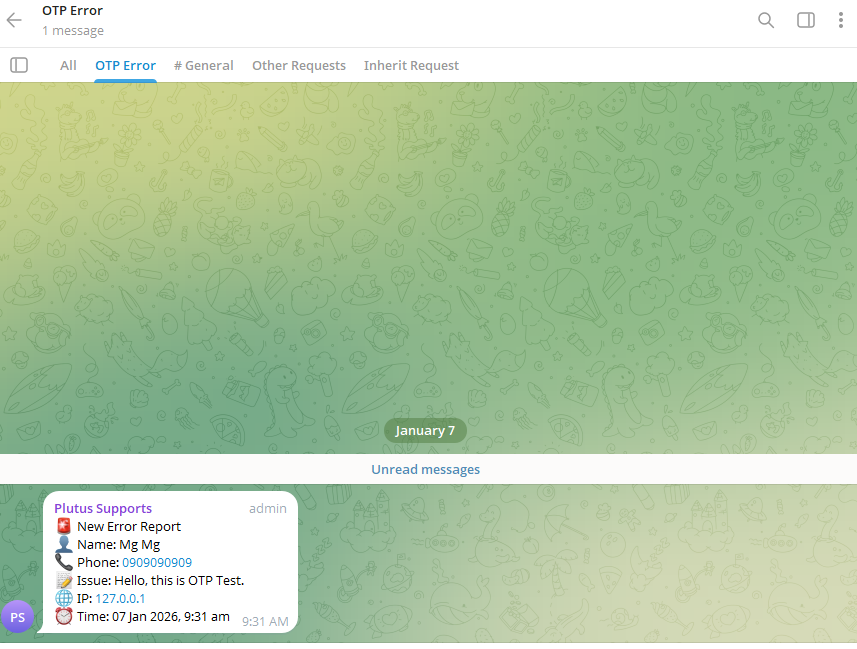

# Laravel Telegram Topic Logger

[](https://packagist.org/packages/minkhantnaung/laravel-telegram-topic-logger)
[](https://packagist.org/packages/minkhantnaung/laravel-telegram-topic-logger)
[](LICENSE.md)

A Laravel custom logging channel that sends application logs to Telegram groups or channels, with full support for Telegram **topic threads** (`message_thread_id`) using Monolog v3.



> **Note:** This package supports public and private Telegram groups, supergroups, and channels.

## Why use this package?

- ✅ Supports Telegram **topic threads** (`message_thread_id`)
- ✅ Works with Monolog v3 and Laravel 11+
- ✅ Simple custom channel configuration
- ✅ No third-party Telegram SDK required

## Requirements

- PHP >= 8.2
- Laravel >= 11.0
- Monolog >= 3.0

## Installation

You can install the package via Composer:

```bash
composer require minkhantnaung/laravel-telegram-topic-logger
```

## Configuration

### 1. Publish the configuration file (optional)

```bash
php artisan vendor:publish --tag=telegram-topic-logger-config
```

### 2. Configure your logging channel

Add a custom channel to your `config/logging.php` file:

```php
'channels' => [
    // ... other channels ...

    'telegram_topic' => [
        'driver' => 'custom',
        'via' => \Minkhantnaung\TelegramTopicLogger\TelegramTopicLogger::class,
        'chat_id' => env('TELEGRAM_CHAT_ID'),
        'thread_id' => env('TELEGRAM_THREAD_ID'), // Optional: for topic threads
        'token' => env('TELEGRAM_BOT_TOKEN'),
        'level' => env('TELEGRAM_LOG_LEVEL', 'debug'),
    ],
],
```

### 3. Environment Variables

Add the following to your `.env` file:

```env
TELEGRAM_BOT_TOKEN=your_bot_token_here
TELEGRAM_CHAT_ID=your_chat_id_here
TELEGRAM_THREAD_ID=your_thread_id_here  # Optional
TELEGRAM_LOG_LEVEL=debug
```

## Usage

Once configured, you can use the logging channel in your application:

```php
Log::channel('telegram_topic')->info('This is an info message');
Log::channel('telegram_topic')->error('This is an error message');
Log::channel('telegram_topic')->warning('This is a warning message');
```

Or add it to your stack:

```php
'stack' => [
    'driver' => 'stack',
    'channels' => ['single', 'telegram_topic'],
    'ignore_exceptions' => false,
],
```

## Example: Sending Error Reports

```php
Log::channel('telegram_topic')->error(
    "🚨 OTP Error\nUser ID: 123\nPhone: 09xxxxxx"
);
```

## Getting Your Telegram Bot Token

1. Open Telegram and search for [@BotFather](https://t.me/botfather)
2. Send `/newbot` and follow the instructions
3. Copy the bot token provided

## Getting Your Chat ID

This package works with both **public** and **private** Telegram groups and channels.

1. Add your bot to a group or channel (public or private)
2. Send a message to the group/channel
3. Visit `https://api.telegram.org/bot<YOUR_BOT_TOKEN>/getUpdates`
4. Find the `chat.id` value in the response

## Getting Your Thread ID (for Topics)

> ⚠️ Telegram topics are available only in **supergroups**.  
> If `thread_id` is not provided, messages will be sent to the **General** topic.

1. Enable topics in your Telegram group
2. Create a topic or use an existing one
3. Send a message to the topic
4. Visit `https://api.telegram.org/bot<YOUR_BOT_TOKEN>/getUpdates`
5. Find the `message_thread_id` value in the response

## Support the project

If this package helps you, please consider giving it a ⭐ on GitHub.
It helps others discover the project and motivates further development.

## License

The MIT License (MIT). Please see [License File](LICENSE.md) for more information.

